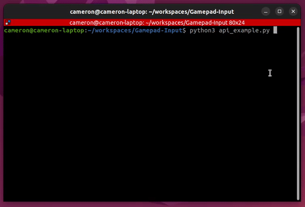

# Gamepad Input API
A wrapper for Pygame's joystick module
 
Author: Cameron Rosenthal @Supernova1114
 

Pygame: https://github.com/pygame/pygame

#### Testing
- Tested with Python 3.10, Pygame 2.1.2
- Tested on Jetson Linux DP 6.0 with Nvidia Jetson AGX Orin.
- Tested on Ubuntu 22.04 Desktop with an amd64 laptop.
- Tested on Ubuntu 22.04 Server with Raspberry Pi 4B
- Controllers tested: XBox One S, PS4, PS5, 8BitDo Ultimate C 2.4G.

#### Linux install Pygame: 

    pip3 install pygame

#### Features
- Controller hot-plug support.
- Support for matching button and axis layouts across different controllers.
- Function callbacks for button presses (Async), in addition to button value reading.
- Easy access to grouped joystick axis data. (Ex: (x,y) for Left Stick).
- Axis deadzones.
- Muliple-controller support.
#### Examples and Gamepad tester
- Example use of API is shown in api_example.py
- Pygame's gamepad tester is controller_test.py
#### Creating a controller configuration
- Use controller_test.py or an online gamepad tester to see button and axis ID's, and controller name.
- Open gamepads.config and assign correct ID's to each button / axis.
- Make sure controller name is correct.

#### Notes
- To get this working on a Jetson AGX Orin, I had to add the joydev kernel module to its linux installation, and have the Jetson automatically login.
- Bug within PyGame where an 8BitDo wireless controller would default some axes to 1 or -1 until any button was pressed.

